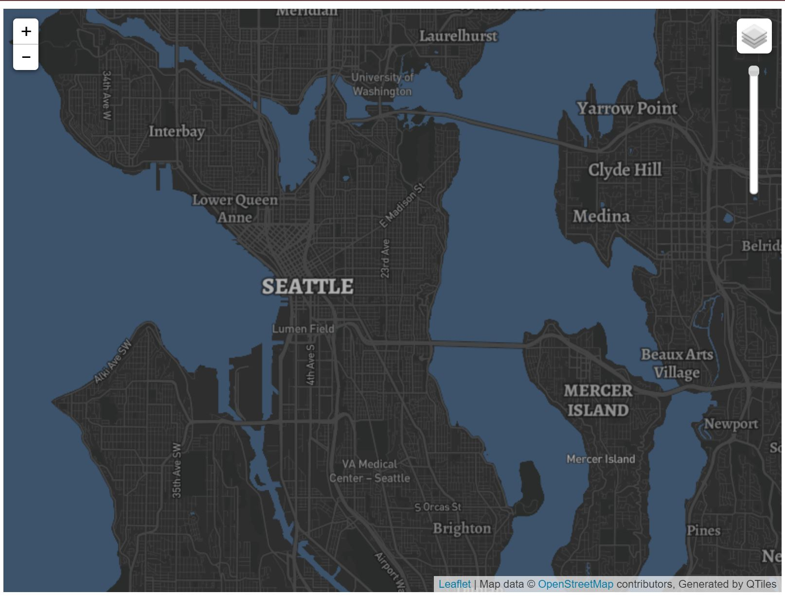
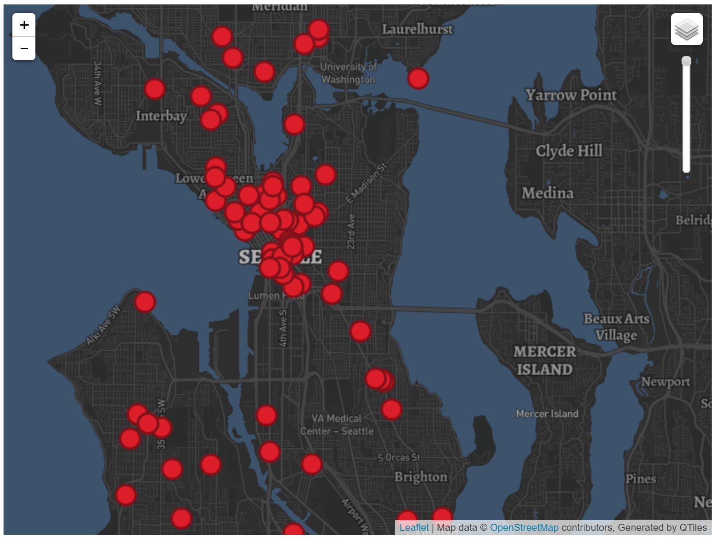
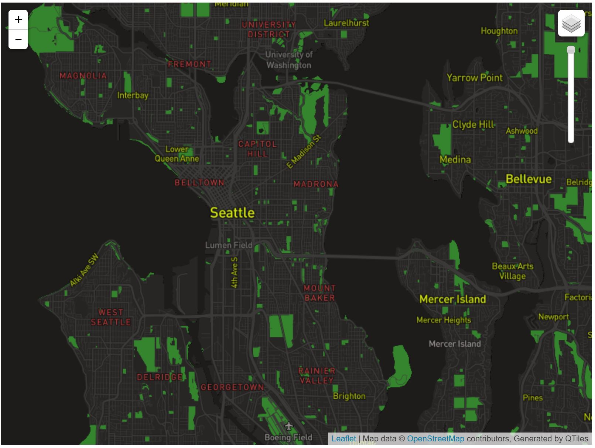

# Generating Map Tiles

## Tile 1 - Modified Basemap

- Description of Tile: Modified basemap simplified to reduce the amount of labels on roadways and neighborhoods, highlighting all netowrking streets, major roads, city names, and major neighborhoods in the seattle area. 
- Geographic Area of Focus: Seattle Washington and neighboring cities 
- Zoom Levels: Max Zoom - 14; Min Zoom - 10

## Tile 2 - Map Data (911-Fire Calls, Seattle)

- Description of Tile: Data layer showing the location of 911 calls made to the Seattle fire department from January 2020 to February 2021.
- Geographic Area of Focus: Seattle Washington and neighboring cities 
- Zoom Levels: Max Zoom - 14; Min Zoom - 10

## Tile 3 - Basemap and Data 

- Description of Tile: Tile using the initial modified basemap and the mapped data from the second tile.
- Geographic Area of Focus: Seattle Washington and neighboring cities  
- Zoom Levels: Max Zoom - 14; Min Zoom - 10

## Tile 4 - Black History Month Theme

- Description of Tile: Created using a color scheme inspired by Black History Month. 
- Geographic Area of Focus: Seattle Washington and neighboring cities 
- Zoom Levels: Max Zoom - 14; Min Zoom - 10

